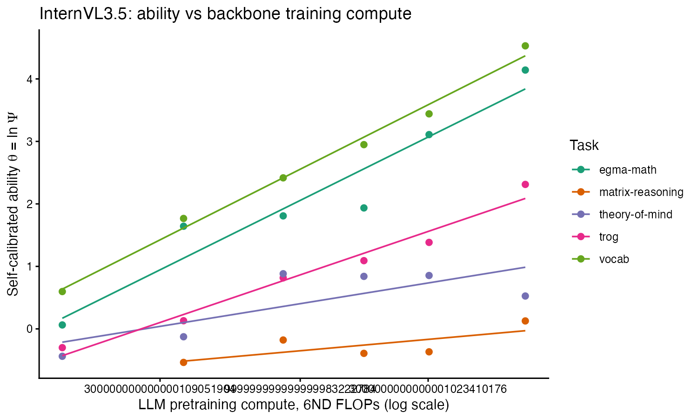

# Scaling exponents for VLMs on a children's cognitive battery

Companion analysis for *How Smart Is It Possible to Be?* (Chituc, in prep).
Estimates power-law scaling exponents — capability ∝ resources^α — for
vision-language models evaluated on the six LEVANTE developmental tasks,
with capability measured on a ratio scale via a log-interval interpretation
of the Rasch model.

## Idea

Fit a Rasch model to the models' item-level responses (models as "persons,"
task items as items). Under a log-interval reading of item response theory,
the latent ability θ is the logarithm of a ratio-scale magnitude Ψ = e^θ
(scale unique up to a positive multiplicative constant; zero = absence of
the ability). A power law Ψ = a·R^α is then equivalent to
θ = ln a + α·ln R, so **α is estimated directly as the OLS slope of θ on
log resources**. No child data enters the presented analysis: item
difficulties are calibrated from the model responses themselves
("self-calibrated"), and the exponents are invariant to that choice (a
child-anchored variant, kept as a robustness check, gives the same answers
within confidence intervals).

## Data

All model-response data are fetched from the public results bucket of
**LEVANTE-bench** (Tan, Cardinal, Lorido-Botrán, Bravo-Sánchez, Yu, &
Frank; arXiv [2606.05497](https://arxiv.org/abs/2606.05497)):
`gs://levante-bench`, read anonymously via the Google Cloud Storage JSON
API. Each open-weight model was run 10 times per item with randomized
option order; trials are pooled to k-of-10 correct per model × item.
LEVANTE-bench data are for **noncommercial use**; this repository
redistributes only derived statistics (fitted parameters), not the
underlying trial data — the download script re-fetches those from the
authors' bucket.

Tasks: TROG (receptive grammar: sentence → picture with grammatical
foils), vocabulary (word → picture), EGMA math (early-grade arithmetic,
number identification, number-line), theory of mind, matrix reasoning,
and mental rotation. **Mental rotation is excluded from the exponent
fits**: every model sits at the 2AFC guessing floor at every size (fitted
slope ≈ 0.02, R² ≈ 0.07), so there is no scaling signal to estimate.

## Results

Self-calibrated exponents, slope of θ on ln(nominal parameters).
InternVL 3.5 is the deepest size series (1B–38B, n = 6); the pooled fit
uses every open-weight model with a documented size (floor-flagged cells
excluded; family-level differences then sit in the residuals):

| Task | α (InternVL 3.5) | 95% CI | R² | α (pooled, all families) | 95% CI | R² |
|---|---|---|---|---|---|---|
| Vocabulary | 1.02 | [0.84, 1.20] | 0.985 | 1.55 | [0.89, 2.21] | 0.66 |
| EGMA math | 1.01 | [0.61, 1.41] | 0.925 | 0.95 | [0.51, 1.39] | 0.60 |
| TROG (grammar) | 0.70 | [0.58, 0.81] | 0.986 | 0.85 | [0.57, 1.13] | 0.82 |
| Theory of mind | 0.30 | [−0.13, 0.73] | 0.49 | 0.41 | [0.27, 0.55] | 0.70 |
| Matrix reasoning | 0.17 | [−0.10, 0.44] | 0.56 | 0.21 | [0.00, 0.41] | 0.66 |

Training-compute axis (InternVL 3.5 only): the family's language backbones
are Qwen3-0.6B/1.7B/4B/8B/14B/32B (InternVL3.5 report, arXiv
[2508.18265](https://arxiv.org/abs/2508.18265), Table 1), all pretrained
on the same 36T tokens (Qwen3 report, arXiv
[2505.09388](https://arxiv.org/abs/2505.09388)). With C = 6ND (FLOPs
1.3×10²³ → 6.9×10²⁴):

| Task | α on training compute | 95% CI | R² |
|---|---|---|---|
| Vocabulary | 0.94 | [0.81, 1.07] | 0.991 |
| EGMA math | 0.92 | [0.55, 1.30] | 0.92 |
| TROG (grammar) | 0.63 | [0.48, 0.79] | 0.97 |
| Theory of mind | 0.30 | [−0.05, 0.66] | 0.58 |
| Matrix reasoning | 0.17 | [−0.12, 0.45] | 0.54 |

The within-paradigm ordering — one architecture, one instrument, only the
task changing — runs: vocabulary ≈ math (α ≈ 1) > grammar > theory of
mind > matrix reasoning > mental rotation (α ≈ 0).



## Reproducing

Requirements: Python ≥ 3.10 (stdlib only) for the downloader; R with
dplyr, readr, purrr, tidyr, stringr, ggplot2, jsonlite, tibble.

From the repository root:

```bash
python3 scripts/62a_levante_download.py   # mirror the public bucket (~270 MB)
Rscript scripts/62b_levante_data_check.R  # pre-flight data checks
Rscript scripts/62d_levante_selfcalibrated.R  # presented analysis (θ, α, figure)
Rscript scripts/62g_levante_compute_axis.R    # training-compute axis
```

Every estimation script begins with a validation gate that recovers known
parameters from simulated data (θ recovery bias 0.003; α recovery bias
≤ 0.005, seed 42) and halts if recovery fails. Fitted outputs land in
`processed_data/` and `figures/`; the copies committed under `results/`
and `figures/` are the versions reported above.

Supporting scripts, not part of the presented pipeline:
`62c` child-anchored variant (robustness; same exponents within CIs),
`62e` math-by-subtype diagnostic (too few items per subtype for stable
fits; number identification is at ceiling for InternVL at every size),
`62f` Aquila-VL-2B training-checkpoint probe (no usable exponent: the
public exports are single-run and non-monotone across checkpoints).

## Specification notes

- Response model: P(correct) = plogis(θ + d), plain Rasch (discrimination
  1, no guessing parameter). Cells at or near chance are excluded by a
  floor rule (accuracy ≤ 0.35 on 3–4-option tasks) rather than modeled
  with a guessing floor.
- Identification: mean item easiness = 0 per task; θ estimated jointly
  with item easiness by two-way binomial logit fixed effects (JML).
  Estimator bias quantified by simulation before use (see validation
  gates in the scripts).
- Resource axes: nominal parameter counts from the authors' model labels;
  training compute from sourced backbone sizes and token counts as above.
  Closed-weight models (GPT, Gemini) are excluded from all fits (no
  documented sizes). Gemma 4 appears only in secondary fits (its "E"
  sizes are effective, not total, parameters).
- Fitting: OLS in log space (additive error on θ = multiplicative error
  on Ψ), analytic 95% CIs; case bootstrap where n ≥ 4.

## License

Code: MIT. Fitted results and figures: CC BY 4.0. Underlying LEVANTE-bench
data: see the [LEVANTE-bench repository](https://anonymous.4open.science/r/levante-bench-3013/)
(noncommercial); not redistributed here.
